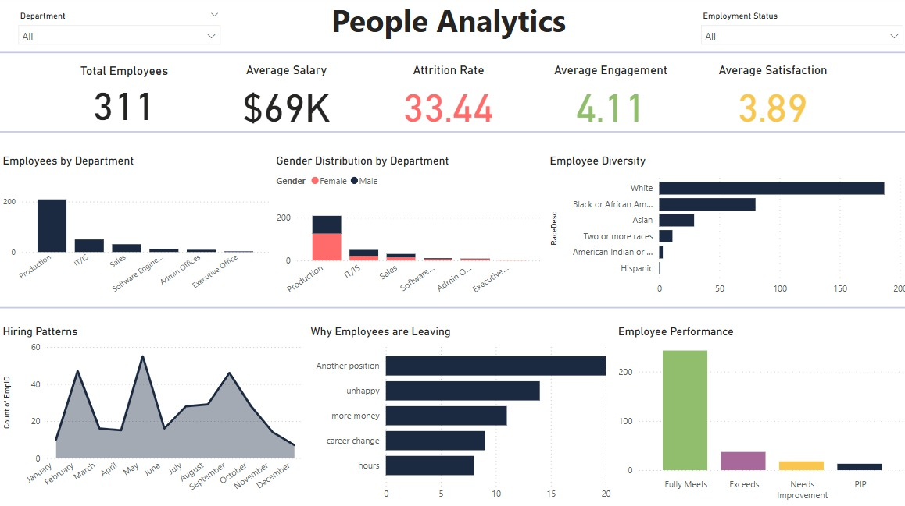

# 🧠 People Analytics Dashboard | Power BI

A one-page dashboard that turns HR data into a visual story — from employee satisfaction to attrition trends, diversity insights, and performance metrics.

After an interview for a data analytics intern position in the People Analytics department (👀 manifesting), I realized I hadn’t really worked on anything HR-specific. So I challenged myself to change that.

This dashboard was built with love (and Power BI) to explore what it means to understand people through data.

---

## 📊 What's Inside

- **Engagement & Satisfaction Scores**  
- **Attrition Rate** (with term reason breakdown)  
- **Hiring Patterns**  
- **Diversity Metrics** (Gender, Race, Departments)  
- **Performance Distributions**

Everything is wrapped in a clean, structured layout — and built to be as actionable as it is aesthetic.

---

## 🗂 Dataset Used

**Human Resources Data Set**  
By Dr. Rich Huebner and Dr. Carla Patalano  
[Available on Kaggle →](https://www.kaggle.com/datasets/rhuebner/human-resources-data-set)

This dataset contains:
- Core HR data (positions, salaries, demographics)
- Production staff performance
- Recruitment source costs
- Diversity indicators
- Attrition status + termination reasons

---

## 💡 Why This Dashboard Matters

People Analytics is about more than just dashboards — it’s about understanding the *why* behind the numbers.  
This project was my attempt to do just that — to explore how hiring patterns, satisfaction levels, and demographic trends all work together to shape employee outcomes.

---

## 🔗 Preview

> Made with Power BI  
> Designed & developed by [@Mariam](https://www.linkedin.com/in/your-link-here)

---

## ✨ Let’s Talk!

Feedback is very welcome — especially if you’re in HR, People Analytics, or just love clean dashboards.

